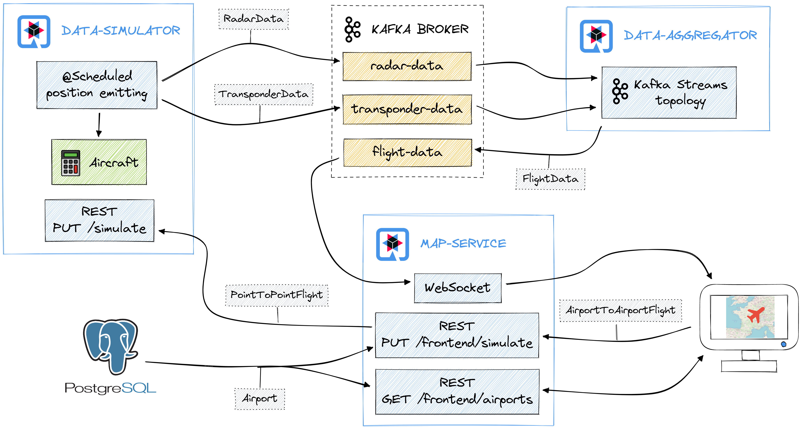

# Live Flight Tracker Demo

## Architecture of the demo

## How to run the demo locally

From the root directory of the repository:

1. Run `./mvnw clean install -pl :flight-tracker-common` to build the `common` module and install its jar into your local Maven repository.
2. Run `./mvnw clean quarkus:dev -pl :flight-tracker-data-simulator` to start the `data-simulator` Quarkus app.
3. Open another terminal and run `./mvnw clean quarkus:dev -pl :flight-tracker-data-aggregator` to start the `data-aggregator` Quarkus app.
4. Open another terminal and run `./mvnw clean quarkus:dev -pl :flight-tracker-map-service` to start the `map-service` Quarkus app.
5. Open http://localhost:8090 and start playing with the UI.

This demo does not require any local Kafka server or PostgreSQL server.
Quarkus will automatically start these servers in dev mode (`quarkus:dev`) thanks to the [Quarkus Dev Services](https://quarkus.io/guides/dev-services). 
The Kafka Dev Service will be shared between all apps of the demo, meaning that the apps will automatically be able to exchange messages through the Kafka topics.